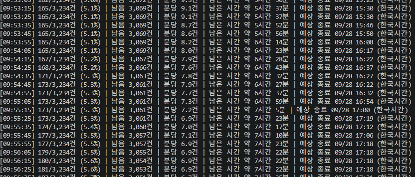
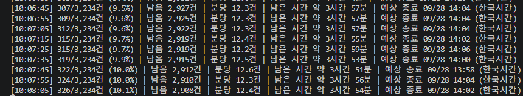

# 네이버 자료 수집기의 네트워크 대기 병목 개선

## 문제와 구현

3,234개 제주 POI의 정보를 보강하기 위해 장소별 연관검색어로 지역·웹·블로그 API를 조회하고, 관련 본문을 확보하는 수집기를 운영했다. POI 단위 작업자를 늘려도 API 호출 경로의 공용 잠금이 네트워크 응답과 재시도 대기까지 포함하면 다른 작업자가 기다리는 병목이 남았다.

현재 구현은 `ThreadPoolExecutor`로 동기 HTTP 요청을 동시 실행한다. HTTP 파이프라이닝, HTTP/2 멀티플렉싱 또는 asyncio 전환으로 표현하면 구현과 다르다. 별도 생산자·소비자 큐로 검색과 본문 단계를 완전히 분리한 구조도 아니다.

변경 사항:

1. 캐시 조회·저장 시에만 DB 잠금을 잡고 HTTP 응답은 잠금 밖에서 기다린다.
2. 같은 검색 키는 개별 잠금으로 묶어 동시 중복 호출을 방지한다.
3. 전체 작업자가 요청 시작 간격 0.25초, 요청 시도 예산, 429 cooldown을 공유한다.
4. 실행 중 작업 수를 workers 이하로 제한한다. 실제 지원 범위는 1~6이다.
5. SQLite 체크포인트를 유지하고 실패한 장소는 완료 처리하지 않아 재개 시 재시도한다.
6. 본문 수집은 같은 원점의 접근 간격과 robots 규칙을 유지한다. 같은 호스트가 느리면 여전히 병목이 될 수 있다.

공개한 코드는 변경 후 스냅샷이다. 구버전 실행 전체와 네트워크 트레이스는 포함하지 않는다. 잠금 분리 동작은 모의 HTTP 테스트로 검증한다.

## 화면에서 재계산한 처리량

2026-09-28, 한국시간. 각 이미지의 **처음과 마지막 완전히 보이는 행**을 사용했다. 잘린 경계 행은 제외했다. 분당 속도 표시의 내부 계산식을 추측하지 않고 누적 완료 건수의 차이를 시간 차이로 나눴다.

| 항목 | 변경 전 | 변경 후 |
|---|---:|---:|
| 관측 시작 | 09:53:15 | 10:06:45 |
| 관측 종료 | 09:56:25 | 10:08:15 |
| 누적 완료 | 165 → 181 | 307 → 328 |
| 관측 시간 | 190초 | 90초 |
| 관측 중 처리 | 16건 | 21건 |
| 계산 처리량 | 5.05건/분 | 14.00건/분 |
| 집계상 건당 소요시간 | 11.88초 | 4.29초 |

계산:

```text
변경 전 = (181 - 165) / 190 × 60 = 5.05263158건/분
변경 후 = (328 - 307) / 90 × 60 = 14건/분
처리량 배수 = 14 / 5.05263158 = 2.77083333배
처리량 증가율 = (2.77083333 - 1) × 100 = 177.08%
집계상 건당 시간 감소율 = (1 - 1 / 2.77083333) × 100 = 63.91%
```

여기서 건당 소요시간은 처리량의 역수다. 개별 요청 지연시간이나 각 장소의 실제 응답시간을 측정한 값이 아니다. 화면에 표시된 분당 속도는 변경 전 6.9~9.1, 변경 후 12.3~12.6으로, 위 구간 재계산과 집계 창이 다를 수 있다.





재현:

```bash
python docs/evidence/2026-09-28/calculate.py
```

## 해석의 범위

두 구간은 길이와 처리 대상이 다르다. 작업자 수, 캐시 적중, 본문 길이, 원점별 대기, 외부 서버 상태가 고정됐다는 증거는 없다. 따라서 **관측 구간 처리량이 약 2.77배로 높아졌다**고 기록한다. 전체 실행 시간이 64% 줄었다거나 잠금 분리 하나의 인과 효과가 177%라고 단정하지 않는다. 종료 예상 시각은 남은 건수·추정 속도가 함께 바뀌므로 성과 산정에서 제외했다.

후속 정식 비교에서는 같은 입력·workers·캐시 조건으로 여러 번 실행하고, API 대기·본문 대기·캐시 적중률·429 발생·완료율을 함께 측정해야 한다. 현재 보고서에는 그 실험을 했다고 주장하지 않는다.

## 자소서 문안

> 제주 관광 POI 3,234건의 상세정보 수집 과정에서 병렬 작업자를 늘려도 처리 속도가 떨어지는 문제를 겪었습니다. 수집 코드에서 API 응답을 기다리는 동안 공용 잠금을 유지하는 구조를 확인하고, 캐시 접근과 네트워크 요청의 잠금 범위를 분리했습니다. 동일 검색어 중복 호출 방지, 전역 요청 간격과 재시도 제어, 체크포인트 재개 기능을 함께 유지했습니다. 변경 전후 실행 화면의 관측 구간을 재계산한 결과 처리량은 분당 5.05건에서 14건으로 약 2.77배 높아졌습니다. 관측 조건의 차이를 명시하고, 처리 속도와 정보 검증 품질을 별도 지표로 관리했습니다.

면접에서는 “Python 스레드를 통한 I/O 동시성, 공용 잠금의 범위 축소, 요청 속도 제한과 재개 가능성”을 중심으로 설명할 수 있다. 장기 실행 완료 결과가 확보되면 이 구간 관측치와 구분해 추가 기록한다.
